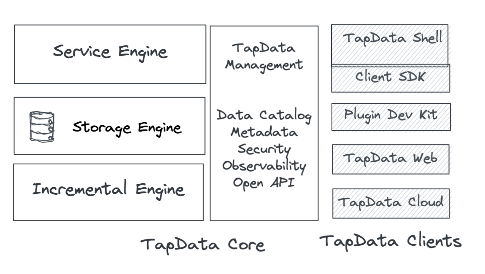

# Architecture & Fundamentals

## Tapdata Components Overview

The Tapdata Platform consists following components: 

#### Tapdata Core Components:

- Incremental Engine(IE): The core component handles data capture, process and output tasks. 

- Service Engine(SE): responsible for publish & serve Data API

- Tapdata Management(TM): Functionalities necessary for the data platform, including job management, monitoring, metadata, security, users & permissions etc. 

#### Tapdata Client Components

- Tap Shell: Interactive shell to author, run & monitor pipelines and manage data APIs. 

- Client SDK: Language SDKs to manage/interact with Tapdata from programming language, currently only Python is supported. Java is on the roadmap. 

- PDK: Plugin Development Kit for custom sources, targets & processors

## Incremental Engine

Incremental Engine is the core power house in Tapdata platform.  It handles following key tasks:

- Receives job specifications from Tapdata management & execute the job/pipeline
- Capture data from source databases (or API sources), in batch or using CDC(most time)
- Performs statueful & stateless transformations & computations on the data pipelines, including filtering, merging, joining, cache lookup etc. 
- Write output to the data destinations, typically database or data warehouses. 
- Performs incremental data verifications. 

## Storage Engine

Tapdata may store two kinds of data in data store: Change Events & Customer Data. 

To serve data via RESTful API, Tapdata replicates the data from source systems and store them in centralized data store. 

To enable event-driven data processing and real time reverse ETL, Tapdata will keep certain amount of change events Tapdata captured from data sources. 

In order to store these two types of data, Tapdata inclueds a distributed database in the installation. Currently MongoDB is used for the default storage option.   In the future, additional database type(such as MySQL or TiDB) may be supported via the Storage Engine API(Planned feature)

## Service Engine

Service Engine is written in Node.js. The primary purpose is to enable the data serving via RESTful API. Once you have created & configured your data API in Tapdata
Management， the API definition will be picked up by Service Engine, when a HTTP request arrives at the API Server, Service Engine will automatically route the request to the  generated code, the code will in turn to retrieve data from database, format it, and send back to the requester.

Service Engine is optional if you only use Tapdata for data integration & data processing. 

## Data Architecture

There are two primary use case categories for Tapdata:

- As a data integration / data processing platform
- As a data as a service or real time data platform

When you use Tapdata as a data integration tool, the data archtiecture is fairly simple, typically involes from source to processor to target. 

When you use Tapdata as a real time data platform, things will be a bit more complex. The data flow would include:

1. Capture & Process
2. Unify & Store 
3. Publish & Serve

FDM / MDM / ADM concept is originated fro  IBM's Master Data Management theory & practice. They represents the tiering/layering approach typically found in centralized data management. They're similar to data warehouses ODS/DWD/DWS/DM tiering concept.

Foundational Data Model, or FDM, is similar to data warehouse's ODS layer. In this layer we will store a nearly identical copy of the source data. With minimum processing and transformations, iDaaS will be able to ensure the correctness, consistency and promptness of the data in FDM layer. 

Master Data Model, defines the enterprises main object data model. 

Application Data Model, which can consists of Analytical & Transactional applications, defines the data models based on the downstream applications. This is usually optional step. 

All the data movement from data sources to FDM layer, from FDM to MDM, are all handled by the Incremental Engine, which provides near real time data replication & on-the-fly transformation capability. 

FDM/MDM/ADM are only logical layering, physically they're still supported by database storage. 

## Terms & Concepts

- Connections 
- Tables
- iModels (Replicated, Joined, Aggregated data models)
- Data API  
- Job
- Pipeline

#### Connections/Databases

Database contains a collection of tables and requires connection information to access. For each database we require a connection to be setup.   

Note database is a broader term. In case data source is an application or file system, database can refer to the  application name and Directory/Folders. 

#### Tables

Table holds rows of data.  Table also has broader meaning: in a non-database data source, Table could be an Object(such as Customer or Opportunity in a CRM SaaS), or CSV file, or a specific RESTful API. 

#### Incremental Model

In DaaS architecture, data in centralized store are typically replicated from sources. Hence  we call a table in DaaS data store "Incremental Model" or iModel as they're incrementally updated by the change events occurred in the source systems. 

iModels a subset of "Tables" 

#### Data API

To facilitate instant access to the managed data, Tapdata can automatically generate RESTful API code (nodejs) when you publish a Data API for a table(in relatioanl databases) or collection (in MongoDB).  When you start a complete Tapdata installation, one or more API Server instances will run and listen on the 3030 port(configurable). When a HTTP request arrives at the API Server, Tapdata will route the request to the proper API code to handle the request. 

 
### Pipeline

A pipeline is an unit of primary data processing work. It typically includes one or more data sources(tables), zero or more processing nodes, and at least one output destination. A pipeline can typically be represented by a DAG diagram.   

 
